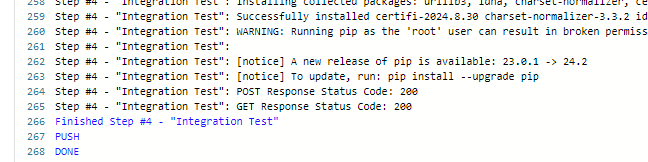
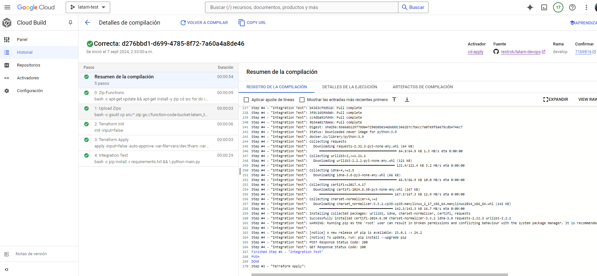
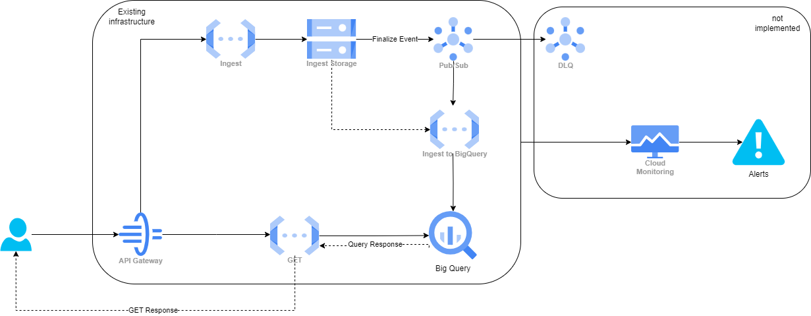
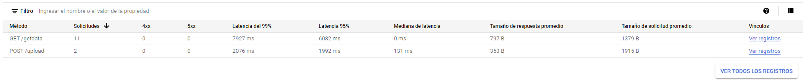
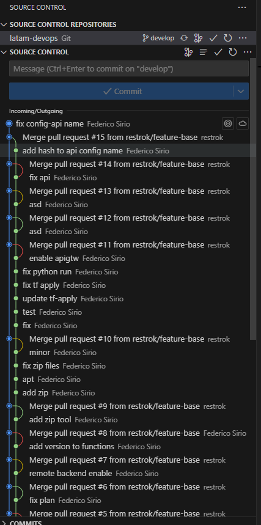

# Desafío Técnico DevSecOps/SRE

## Contexto
Se requiere un sistema para ingestar y almacenar datos en una DB con la finalidad de hacer analítica avanzada. Posteriormente, los datos almacenados deben ser expuestos mediante una API HTTP para que puedan ser consumidos por terceros.

## Objetivo
Desarrollar un sistema en la nube para ingestar, almacenar y exponer datos mediante el uso de IaC y despliegue con flujos CI/CD. Hacer  pruebas de calidad, monitoreo y alertas para asegurar y monitorear la salud del sistema.

## Parte 1: Infraestructura e IaC
### 1. Infraestructura Necesaria para la Ingesta de Datos
ApiGateway: Expone un endpoint HTTP que permite la recepción de datos a través de un POST request. El path configura una Cloud Function como backend.

Cloud Function (Ingesta): Recibe el archivo CSV mediante POST request y lo almacena en un bucket de Google Cloud Storage.

Google Cloud Storage: Al recibir un nuevo archivo CSV, emite un evento que se comunica con Google Cloud Pub/Sub.

Google Cloud Pub/Sub: Al detectar el nuevo mensaje, activa otra Cloud Function encargada de procesar y almacenar los datos.

Cloud Function (Procesamiento): Lee el contenido del archivo CSV del bucket y lo inserta en Google BigQuery para su almacenamiento y análisis.

### 2. Infraestructura Necesaria para la Exposición de Datos
ApiGateway: Contiene un path adicional que, mediante un GET request, acciona otra Cloud Function.

Cloud Function (Consulta): Realiza un query a Google BigQuery y devuelve los datos solicitados en respuesta al GET request.

Con esta configuración, se logra un flujo de datos que va desde la recepción y almacenamiento en bruto hasta la transformación y disponibilidad para análisis y consumo por parte de terceros. La infraestructura serverless permite escalar según la demanda y simplifica la gestión operativa del sistema.

### 3. Terraform
Toda la IaC se encuentra dentro de la carpeta "infra" del repositorio.

## Parte 2: Aplicaciones y flujo CI/CD

Se utiliza un único repositorio para infraestructura y aplicación, con pipelines diferenciados para 'develop' y 'master'. Se recomienda separar infraestructura y aplicación en repositorios distintos para entornos productivos.
Adicionalmente como buena practica se debe separar el pipeline de Continuous Integration y Continuous Deployment.

#### Pipelines Step-by-Step:
- Push a la branch 'develop'
   - Paso uno correr los Unit Test
   - Paso dos generar los artefactos para cada Cloud Function y subirlo al bucket correspondiente.
   - Paso tres validar terraform
   - Paso cuatro inicializar terraform
   - Paso cinco terraform plan
- Push a la branch 'master'
   - Paso uno correr los Unit Test
   - Paso dos generar los artefactos para cada Cloud Function y subirlo al bucket correspondiente.
   - Paso tres validar terraform
   - Paso cuatro inicializar terraform
   - Paso cinco terraform apply
   - Test de Integracion

#### Algunas aclaraciones:
   - Se utiliza una convención de nombres para artefactos.
 '<function_name>-<develop/master>.zip'
   - Los Unit Test no están generados, por lo que ese paso se saltea
   - El test de integración solo espera como respuesta valida un 200. Por lo qu  e en un ambiente productivo seria necesario mejorar el codigo para validad que realmente la información devuelta por el sistema sea la esperada.
   
   - El 'terraform validate' no se ejecuta para agilizar el proceso, pero es recomendable realizarlo en producción.

#### Ejecuciones:
- Ultima ejecución de CI/CD: https://github.com/restrok/latam-devops/runs/29813460954
- Ultima ejecución de CI: https://github.com/restrok/latam-devops/runs/29813402622

   

### Diagrama de Arquitectura

   

1. **Productores de Datos** publican mensajes usando un endpoint (API HTTP) de ApiGateway, el cual es recibido por una Cloud Function.
2. **cloud function** almacena el mensaje recibido en un bucket
3. **Google Cloud Storage** envia una notificacion por medio de un topico que un nuevo elemento a sido cargado
4. **Google Cloud Pub/Sub** inicializa una cloud fuction que subira los nuevos datos a big query
5. **Google Cloud Functions (Ingesta)** se activa por mensajes en la suscripción de Pub/Sub y procesa los datos, almacenándolos en Google BigQuery.
6. **Google BigQuery** almacena los datos de manera optimizada para análisis.

7. **Google ApiGateway** expone un endpoint HTTP para que terceros puedan consumir los datos almacenados o cargar nuevos.
8. **Google Cloud Functions (API HTTP)** se activa mediante peticiones HTTP gestionadas por Google Cloud ApiGateway y consulta los datos en Google BigQuery.
9bigquery sirve los datos solicitados en la query

## Parte 3: Pruebas de Integración y Puntos Críticos de Calidad

- Como se menciono en la Parte 2, el pipeline de Deploy tiene definido un Integration-Test como ultimo step.
- Actualmente el sistema soporta la ingesta de nuevos datos a traves de un POST al endpoint https://my-gateway-5mjnasuv.uc.gateway.dev/upload con un archivo CSV. 
   - Dataset: https://www.kaggle.com/datasets/mahoora00135/flights
- Actualmente el sistema soporta la consulta de datos almacenados a traves de un GET al endpoint https://my-gateway-5mjnasuv.uc.gateway.dev/getdata. Por cuestiones de tiempo el GET no permite suministrar una query customizada, sino que se encuentra predefinida para devolver los 10 primeros rows.

Seguridad:
 - Por motivos de tiempos no se implemento un sistema de autenticacion a los request de ApiGateway pero se recomienda altamente utilizar un sistema como JWM.
 - Se utilizo una unica Service-Account para todo el ecosistema con permisos amplios. Esto no es lo correcto en un ambiente de production donde debe reiniar el minimo privilegio.

Algunas aclaraciones:
 - Por motivos de seguridad/costos seguramente el endpoint de ApiGateway se encuentre deshabilitado.
 - El sistema se diseño pensando que durante el POST, un usuario podría subir archivos de gran tamaño. Lo que resulto en utilizar el método Funcion>Bucket>Pub/Sub>Funcion y no directamente Pub/Sub como medio para añadir la informacion a BigQuery.
 - La solucion propuesta fue pensada para cubrir con creces el problema planteado. Lejos de ser perfecta, no veo grandes puntos de mejora a corto plazo.
 - Se podria crear alguna estrategia de de auto-healing en caso de que las Cloud Functions fallen por request muy grandes terminando en un time-out.

## Parte 4: Métricas y Monitoreo

### Cloud Functions 
#### Latencia de las solicitudes (Response Time)

   Descripción: La latencia mide el tiempo que tarda tu función desde que recibe una solicitud HTTP hasta que envía una respuesta. Es un indicador crítico del rendimiento y la experiencia del usuario.

   Por qué es importante: Una latencia alta puede indicar problemas de rendimiento en la función o en los servicios con los que interactúa. Monitorear la latencia te ayuda a identificar y corregir cuellos de botella para mantener tiempos de respuesta rápidos.

#### Tasa de errores (Error Rate)

   Descripción: La tasa de errores es el porcentaje de llamadas a la función que resultan en errores. Esto incluye errores de ejecución dentro de la función y errores de infraestructura como timeouts o problemas de recursos.

   Por qué es importante: Una alta tasa de errores puede afectar la confiabilidad de tu aplicación y la satisfacción del usuario. Monitorear esta métrica te permite detectar y responder a problemas que afectan la salud de tu función.

#### Tiempo de Inicio en Frío (Cold Start Time):
   Descripción: El tiempo de inicio en frío se refiere al tiempo que tarda una función en manejar una solicitud después de un período de inactividad, durante el cual la infraestructura subyacente debe inicializar una nueva instancia de la función. Este tiempo incluye la carga del código, la inicialización del entorno de ejecución y cualquier inicio de dependencia que tu función necesite antes de poder procesar la solicitud.
   Por qué es importante: Los tiempos de inicio en frío pueden afectar significativamente la latencia de las solicitudes, especialmente para la primera solicitud después de que la función ha estado inactiva. Monitorear esta métrica te permite entender y mitigar el impacto de los inicios en frío en la experiencia del usuario, y puede ayudarte a tomar decisiones sobre estrategias como el precalentamiento de instancias o la optimización de la inicialización de tu función.

### Cloud Storage

#### Eventos de Creación de Archivos
   Asegúrate de que los eventos de creación de archivos en tu bucket estén siendo registrados. Puedes configurar el registro de auditoría o los registros de acceso para rastrear las operaciones de creación (storage.objects.create) en tu bucket.

### ApiGateway

#### Tasa de Errores (Error Rate):

   Descripción: La tasa de errores es el porcentaje de solicitudes que resultan en errores. Esto incluye errores del cliente (errores 4xx) y errores del servidor (errores 5xx).

   Por qué es importante: Monitorear la tasa de errores puede ayudarte a identificar problemas con la API que afecten la experiencia del usuario, como errores de configuración, problemas de autenticación o errores de backend. Una tasa de errores alta o un aumento repentino pueden ser indicadores de un problema que necesita atención inmediata.

#### Latencia de las Solicitudes (Request Latency):

   Descripción: La latencia mide el tiempo que tarda una solicitud en ser procesada por el API Gateway, incluyendo el tiempo de ida y vuelta de la red, el procesamiento del Gateway y el tiempo de respuesta del backend.

   Por qué es importante: La latencia es un indicador clave del rendimiento de tu API. Una latencia alta puede resultar en una mala experiencia para el usuario final y puede ser un indicador de cuellos de botella en el procesamiento del API Gateway o en los servicios backend. Monitorear la latencia te permite optimizar tus APIs y escalar recursos adecuadamente para manejar la carga de trabajo.

### Todas estas metricas pueden ser generadas en un Dashboard personalizado en el servicio Cloud Monitoring.

   

## Parte 5: Alertas y SRE (Opcional)

En la misma herramienta (Cloud Monitoring) podemos definir nuestras Alertas.

### Caso hipotetico para generacion de alertas
Podemos suponer que nuestro sistema será consumido por 50 aeropuertos y cada uno tiene una capacidad máxima de despegar hasta 10 aviones por hora. Como regla de negocio a cada despegue exitoso se hará un POST a nuestro sistema.

Tendríamos un máximo teórico de 500 solicitudes POST por hora bajo condiciones normales de funcionamiento.

### Ejemplo de Alerta

Alerta de Alta Tasa de Solicitudes (Posible Saturación o Ataque DDoS):

Condición: Si el número de solicitudes POST por hora supera significativamente el umbral esperado de 500, esto podría indicar una posible saturación del sistema o un ataque DDoS.
Configuración de la Alerta: Configura una política de alertas para que se dispare si el número de solicitudes POST excede, por ejemplo, 600 por hora, lo que proporciona un margen para variaciones normales, pero aún es sensible a un aumento inusual.
Alerta de Baja Tasa de Solicitudes (Posible Interrupción del Servicio o Problema de Conectividad):

Condición: Si el número de solicitudes POST por hora es significativamente menor que el umbral esperado, esto podría indicar una interrupción del servicio o un problema de conectividad con los sistemas de los aeropuertos.
Configuración de la Alerta: Configura una política de alertas para que se dispare si el número de solicitudes POST cae por debajo de, por ejemplo, 400 por hora, lo que podría indicar que los aviones no están siendo registrados correctamente.

SLIs y SLOs:
SLI: Latencia de Respuesta de las Solicitudes POST

SLO: El 95% de las solicitudes POST recibirán una respuesta en menos de 300 milisegundos.
Argumento: La latencia de respuesta es crítica para un sistema que procesa despegues de aviones, ya que puede afectar las operaciones en tiempo real de los aeropuertos. Un SLO de 300 milisegundos garantiza un servicio ágil y eficiente. Se desechó un umbral más bajo ya que podría ser demasiado estricto y difícil de cumplir dado el tráfico variable y las dependencias de red.
SLI: Disponibilidad del API Gateway

SLO: El API Gateway estará disponible el 99.9% del tiempo cada mes.
Argumento: La alta disponibilidad es esencial para asegurar que los aeropuertos puedan realizar despegues sin interrupciones. Un SLO del 99.9% equilibra una alta fiabilidad con la realidad operativa de posibles ventanas de mantenimiento y actualizaciones del sistema. Se desechó un SLO del 100% debido a que es poco realista y no permite tiempo para mantenimiento programado.
SLI: Tasa de Errores de las Solicitudes POST

SLO: Menos del 1% de las solicitudes POST resultarán en errores 5xx.
Argumento: Una baja tasa de errores es crucial para la integridad de las operaciones de despegue. Un SLO del 1% permite cierto margen para errores inesperados o problemas transitorios sin comprometer significativamente la funcionalidad general del sistema. Se desechó un SLO más estricto porque podría requerir una redundancia y una infraestructura que excedan el presupuesto y la complejidad necesaria para el sistema.

## Algunas aclaraciones finales:
- Teniendo la posibilidad de usar los servicios nativos de GCP no veo la necesidad de implementar herramientas opensource como FastAPI, MQTT, Prometheus/Grafana.
- Adicionalmente, la implementación de herramientas open-source requeriria a futuro mantenimiento, sin contar todas las configuraciones de seguridad necesarias para correr en un ambiente productivo.
- Por cuestiones de tiempo aqui solo se implementa un ambiente, pero podria cambiarse el naming-convention para hacerlo compatible con multiples ambientes
- Al haber decidido hacer una solucion serverless la escalabilidad o replicacion no deberia ser inconveniente. Ya que esto facilita tanto escalar horizontal como verticalmente.
- Captura de git-flow:

   

